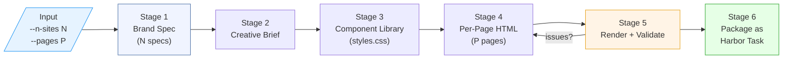
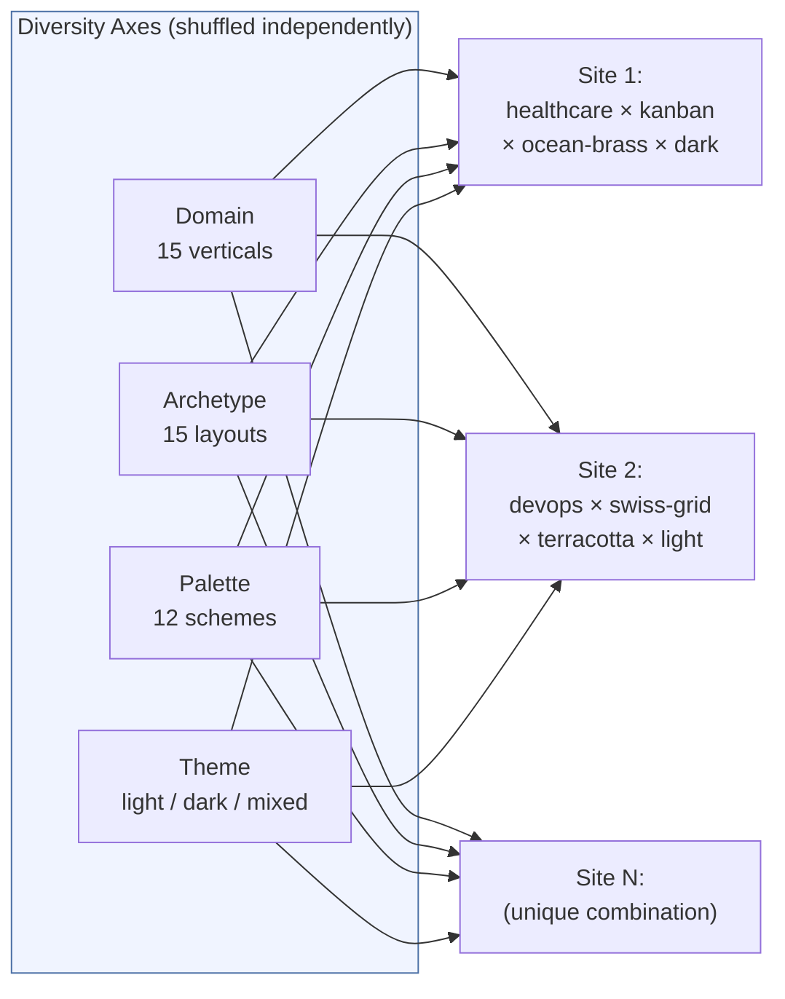
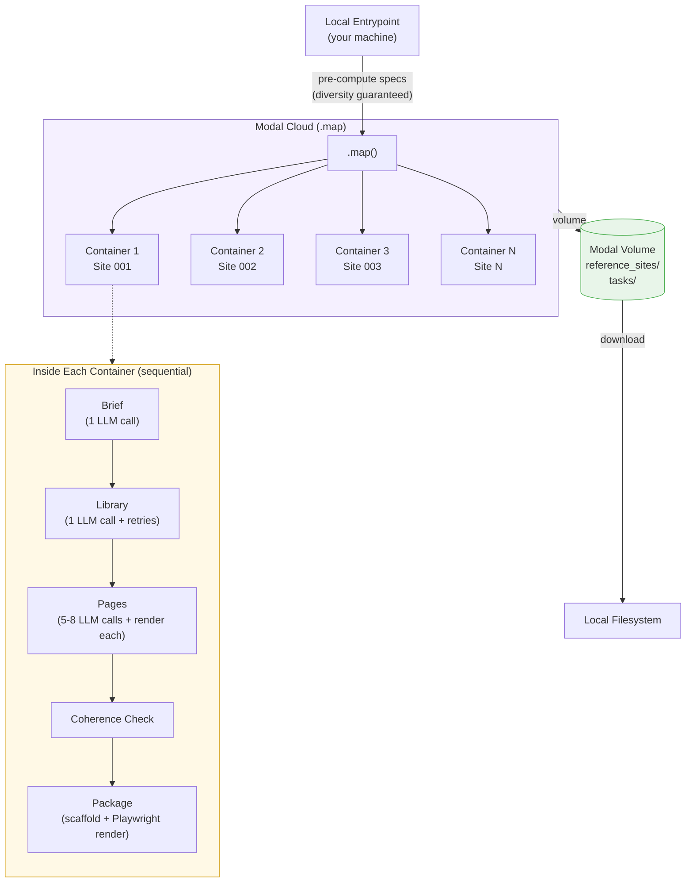

# Data Generation: Generating Reference Websites at Scale

## Overview

The pipeline generates multi-page websites from scratch and packages them as Harbor tasks. Each site is a self-contained HTML+CSS design — no JavaScript, no external dependencies, no crawled content. The full flow runs on Modal (parallel cloud containers) and produces ready-to-grade Harbor task directories. For the architectural reasoning behind these choices, see [Design Decisions](design-decisions.md).



## Stage 1: Brand Spec Sampling

Every site starts with a deterministic brand spec sampled from five diversity axes (defined in [`pipeline/eval_gen/generator/brand_spec.py`](../pipeline/eval_gen/generator/brand_spec.py)):

| Axis | Pool Size | Examples |
|------|-----------|----------|
| **Domain** | 15 verticals | healthcare-emr, devops-platform, ecommerce-admin, fintech-banking |
| **Archetype** | 15+ layout grammars | dashboard-sidebar, kanban-board, swiss-grid, wizard-stepper, bento-grid |
| **Palette** | 12+ curated schemes | slate-red, coral-cream, terracotta-sage, mint-peach, clinical-blue (illustrative — see [Task Showcase](task-showcase.md) for palettes used in the eval set) |
| **Typography** | system stacks | serif, sans-serif, monospace combinations with size scales |
| **Theme** | 3 modes | light, dark, mixed (some pages dark, some light) |

The **shuffle-then-iterate** strategy guarantees no two sites in a single run share any axis value (up to the smallest pool size). Here's how it works:

1. Each axis pool (15 domains, 15 archetypes, 12 palettes, etc.) is independently shuffled with a deterministic seed derived from `{base_seed}-{run_suffix}-{axis_name}`.
2. Site *i* gets `pool[i % pool_size]` from each shuffled pool.
3. When `n_sites ≤ pool_size` (the common case), every site gets a **unique value** on that axis — no two sites share a domain, no two share an archetype, etc.
4. When `n_sites > pool_size`, values cycle deterministically (site 16 reuses the same domain as site 1, but paired with a different archetype/palette).

Per-axis RNG ensures adding a new axis later doesn't perturb existing assignments. The run_suffix is folded into the shuffle seed, so repeated runs produce genuinely different sets (not just renamed directories).

This matters for RL: if two tasks share a domain AND an archetype, the agent could overfit to that combination rather than learning general design replication. Guaranteed uniqueness per axis prevents this.



Each domain defines a **page vocabulary** of 10 page types (e.g., for healthcare-emr: patient-dashboard, appointment-calendar, billing-insurance, settings). The pipeline samples 5-8 of these per site, always including the primary page.

**Why deterministic sampling?** Given a seed + run suffix, every spec is reproducible. This lets us retry individual failed sites without regenerating the batch, and ensures the diversity distribution is controlled rather than random.

## Stage 2: Creative Brief

A single LLM call (Opus 4.7) generates a prose brief from the brand spec. The brief describes the visual identity in natural language — tone, spacing philosophy, component patterns — giving the page generator contextual guidance beyond the raw spec values.

**Design decision:** We use a brief rather than passing raw spec JSON because the page generator produces better results when it has prose context about the overall design intent. The brief also serves as a human-readable audit artifact.

## Stage 3: Component Library (styles.css)

One LLM call generates a shared `styles.css` that defines the design system: color variables, typography scale, spacing tokens, component patterns (cards, tables, navigation, buttons). This is the single source of truth for the site's visual identity.

**Design decision: shared library, not per-page styles.** This mirrors real web development (a design system consumed by multiple pages) and is critical for coherence — all pages share the same header/footer, color scheme, and component patterns. It also makes the grading problem more interesting: the agent must discover and replicate the underlying system, not just pixel-match individual pages.

The library undergoes CSS validation with up to 2 retries. Validation catches issues like missing variable definitions, syntax errors, and responsiveness problems before page generation begins.

## Stage 4: Per-Page HTML Generation

Each page is generated sequentially with the full context: brand spec + brief + styles.css + page purpose from the domain vocabulary. The generator produces a single self-contained HTML file that links to the shared styles.css.

Pages are validated after generation (Stage 5) with up to 2 retries. If validation finds issues (horizontal overflow, off-brand fonts, missing structural depth), the issues are fed back as `previous_issues` and the page is regenerated.

**Design decision: sequential page generation.** Each page sees the same library context, ensuring consistent navigation, footer, and component usage. Parallel generation would be faster but risks divergent header/footer implementations.

## Stage 5: Render + Validate

Every page is rendered at three viewports using Playwright + Chromium, then validated. If any check fails, the page is regenerated (up to 2 retries with the issues fed back as context).

| Viewport | Resolution | Purpose |
|----------|-----------|---------|
| Desktop | 1440×900 | Primary layout |
| Tablet | 768×1024 | Responsive reflow |
| Mobile | 375×812 | Narrow-screen adaptation |

**Design decision: three viewports, not one.** A single viewport lets agents get away with fixed-width layouts that happen to match the reference. Three viewports force genuine responsive design.

Rendering captures:
- **PNG screenshot** (full-page, 1× device scale)
- **DOM sidecar** (.dom.json) — every visible element's tag, bounding box, computed color, background-color, font-family, font-size. This structured data powers the non-pixel metrics (block matching, palette, typography, text similarity).

Validation checks run on every generated page before it's accepted:

**Structural validity:**
- No JavaScript (`<script>` with content) — pages must be pure HTML+CSS
- No CSS animations (`@keyframes`, `animation:`) — references are static screenshots
- Minimum DOM depth (≥4) and tag count (≥15) — catches degenerate single-element pages
- No horizontal overflow beyond viewport width — especially important for tablet/mobile

**Anti-cheat compliance** (same checks the [grader](grading.md#anti-cheat-system) applies to agent output):
- No off-origin requests (Google Fonts, CDNs) — pages must render identically without network access
- No large base64-encoded images (`data:image` URIs >2KB) — small inline SVG icons are allowed
- No `<iframe>`, `<canvas>`, `<object>`, or `<embed>` tags
- No raster image files (.png/.jpg/.gif) in the output
- No oversized inline SVGs (>50% viewport area with >4KB path data)

**Cross-page coherence** (checked after all pages are generated):
- Header/footer HTML equality across pages
- Font-family and color-token variance within expected bounds
- No contradictory theme signals (dark page in a light site, unless explicitly mixed-mode)

Running the same anti-cheat checks at generation time (not just grading time) ensures the reference sites don't contain patterns that would be penalized if an agent reproduced them faithfully. Without this, agents faithfully reproducing inline SVG icons or small data URIs from the reference get false-positive penalized — the reference itself contains patterns the grader flags as cheating.

## Infrastructure: Modal Parallelism

**Design decision: one Modal container per site, not per page.** Sites fan out across containers via `.map()`, but pages within a site run sequentially. This is the right granularity because:
1. Pages share state (the brief, styles.css) that would need to be serialized/deserialized if parallelized
2. Sequential generation ensures consistent header/footer across pages
3. The LLM call latency (~2 min per page) dominates — Playwright rendering is ~5s per viewport

**Rendering parallelism within a container.** While page *generation* is sequential, the rendering step parallelizes across viewports. Each page is rendered at all three viewports concurrently using separate Chromium browser contexts within the same Playwright instance. This cuts per-page render time from ~15s (3 × 5s sequential) to ~5s. The DOM sidecar extraction runs alongside each viewport render, so all three `.dom.json` files are captured in the same parallel batch.



Each container runs the full pipeline for one site: brief → library → pages → render → coherence → package. Sites run in parallel across containers; pages within a site run sequentially (shared state: brief + styles.css).

**Design decision: packaging inside the generation container.** After generating a site, the same container scaffolds the Harbor task and renders reference PNGs. This avoids a separate Modal session for rendering and ensures the reference PNGs are produced by the same Chromium+fonts environment that the verifier will use.

## Why Validation Was Hard (and Necessary)

Each validation check exists because of a specific failure mode that produces a misleading reward signal:

**Responsive generation.** LLMs default to fixed-width patterns (wide tables, multi-column dashboards) that don't reflow at mobile. A non-responsive reference inverts the gradient: a properly-responsive agent submission scores *worse* because its layout doesn't match the cropped reference. Validation rejects references that overflow.

**Off-origin requests.** A reference that loads Google Fonts renders differently from the agent's (network-isolated) render, causing silent font substitution drift. The off-origin check rejects references with external resources.

**Anti-cheat patterns in references.** If the reference embeds inline data URIs or full-width SVGs, an agent faithfully reproducing them trips the same anti-cheat checks at grading time. Running the anti-cheat checks at generation time (symmetric validation) prevents this.

**Degenerate pages.** Without a structural floor (minimum DOM depth, tag count), the generator occasionally produces near-empty pages — a single `<div>` or all content in one `<p>`. These are trivially replicable and add no signal. The structural floor ensures every reference is substantive enough to test design replication.

These checks are load-bearing for the correctness of the reward signal. See [Design Decisions](design-decisions.md) for the architectural reasoning behind each choice.

## Ensuring Training Data Correctness

Several mechanisms ensure the reference screenshots are faithful to the generated HTML:

1. **Same renderer everywhere.** `pipeline/render.py` is used by both the reference renderer (during packaging) and the verifier (during grading). Same Chromium version, same viewport sizes, same font stack. This eliminates macOS↔Linux render drift.

2. **Modal containers pin the environment.** Ubuntu 24.04 + Playwright 1.49.0 + specific font packages. The Docker image is the same for generation, packaging, and verification.

3. **DOM sidecar extracted at render time.** The `.dom.json` files are captured alongside each screenshot, not reconstructed later. This guarantees the structural metrics grade against the exact DOM state that produced the reference PNG.

4. **Off-origin detection.** Both `render.py` and `render_on_modal.py` implement `_is_off_origin()` to catch any external network request during rendering. A reference page that loads Google Fonts would look different when the agent renders without network access — so we catch this at generation time and retry.

5. **Validation retries.** Pages that overflow horizontally, use off-brand fonts, or lack structural depth are regenerated (up to 2 retries). This prevents degenerate references that would be impossible or trivial to replicate.

## Stage 6: Packaging as Harbor Tasks

Each packaged task contains:

```text
tasks/<site-name>/
├── task.toml              # Harbor metadata (timeouts, resources)
├── instruction.md         # Agent instructions (page list, viewport specs)
├── environment/
│   ├── Dockerfile         # Ubuntu + Playwright + Chromium
│   ├── entrypoint.sh      # Starts HTTP server for agent
│   ├── proxy.py           # CONNECT-logging HTTPS egress proxy (observability)
│   └── reference/         # Reference PNGs (what the agent sees)
├── tests/
│   ├── grade.py           # Grader entrypoint
│   ├── metrics.py         # Structured metrics
│   ├── anticheat.py       # Anti-cheat detection
│   ├── vlm_judge.py       # VLM-as-judge metric
│   ├── render.py          # Same renderer used for references
│   ├── viewports.py       # Canonical viewport definitions
│   ├── reference_truth/   # Reference PNGs + DOM sidecars (grader's ground truth)
│   └── build_manifest.json
└── solution/
    └── solve.sh           # Oracle solution (base64'd reference HTMLs)
```

The reference PNGs appear in two places:
- `environment/reference/` — what the agent sees as its target
- `tests/reference_truth/` — what the grader compares against (plus DOM sidecars)

These are the same images, copied at packaging time. The separation exists because Harbor isolates the agent environment from the verifier — the agent cannot access `tests/`.

## Running the Pipeline

The pipeline is fully configurable — `--n-sites` controls how many websites to generate in parallel, and `--pages` controls how many pages each site has. The diversity system (Stage 1) automatically adapts: with more sites it cycles through axis pools; with more pages it samples deeper into each domain's page vocabulary.

```bash
# Generate + package 5 sites (default), 5-8 pages each
modal run pipeline/eval_gen/create_websites_modal.py::generate --run-suffix v9

# Generate 10 sites with exactly 8 pages each
modal run pipeline/eval_gen/create_websites_modal.py::generate --n-sites 10 --pages 8 --run-suffix v9

# Generate a single site for testing
modal run pipeline/eval_gen/create_websites_modal.py::generate --n-sites 1 --pages 5 --run-suffix v9

# Download results
modal run pipeline/eval_gen/create_websites_modal.py::download --what both

# Package pre-existing reference sites (local scaffold + Modal render)
.venv/bin/python pipeline/package.py --source-dir reference_sites_viewport --suffix v9
```
