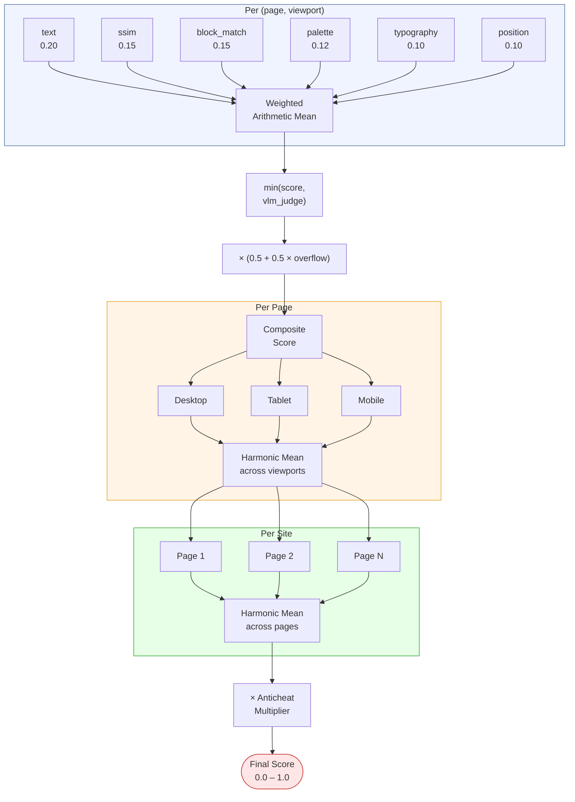
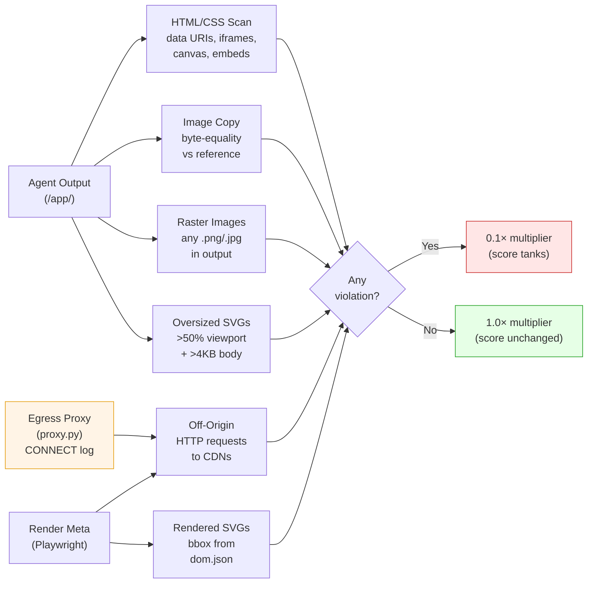

# Grading Methodology

For the architectural reasoning behind the grading choices, see [Design Decisions](design-decisions.md).

## Design Principles

The grading system is built around three principles:

1. **Continuous, not discrete.** Scores range from 0.0 to 1.0 with smooth gradients. An agent that gets the layout right but the colors wrong should score higher than one that produces an empty page. This is critical for RL — discrete pass/fail gives no gradient signal for improvement.

2. **Multi-axis decomposition.** A single pixel-similarity metric conflates many failure modes. We decompose the score into independent axes (structure, color, typography, content, visual) so the reward signal tells the agent *what* it got wrong, not just *how wrong* it is.

3. **Harmonic aggregation punishes inconsistency.** A site that nails 4 pages but completely misses the 5th should score lower than one that does all 5 pages at 70%. The harmonic mean achieves this — one zero pulls the entire score down.

## Metric Suite

Eight metrics, each returning a score in [0.0, 1.0]: six structured (combined via weighted arithmetic mean) plus two applied outside the mean (VLM judge as a `min()` ceiling, overflow as a multiplier). All metric implementations live in [`pipeline/grader/metrics.py`](../pipeline/grader/metrics.py); composite aggregation in [`pipeline/grader/grade.py`](../pipeline/grader/grade.py).

### Structured Metrics (weighted arithmetic mean)

| Metric | Weight | What it measures |
|--------|--------|-----------------|
| **text** | 0.20 | Weighted Jaccard over visible text tokens. Catches content hallucination — fabricated table rows, invented project names, wrong numbers. |
| **ssim** | 0.15 | Structural similarity (SSIM) on the overlapping crop of reference vs candidate PNGs. Pixel-level visual fidelity. |
| **block_match** | 0.15 | Hungarian-matched bounding box IoU between DOM elements. Measures whether the same layout blocks exist in roughly the same positions. |
| **palette** | 0.12 | Area-weighted color comparison in OKLab perceptual space. Separately scores foreground (text) and background colors, then averages. |
| **typography** | 0.10 | Two-part: font-family bucket match (serif/sans/mono) + font-size hierarchy comparison via Hungarian matching. |
| **position** | 0.10 | Normalized centroid drift after Hungarian block matching. Isolates positional accuracy from size accuracy. |

Weights are defined in [`metrics.py:METRIC_WEIGHTS`](../pipeline/grader/metrics.py).

### Applied Outside the Weighted Mean

| Metric | Application | Purpose |
|--------|-------------|---------|
| **vlm_judge** | Hard ceiling on `base`: `base = min(structured, vlm_score)` | Claude Sonnet 4.6 compares reference vs candidate screenshots. Catches semantic errors (wrong chart shape, fabricated UI elements) that structured metrics miss. |
| **overflow** | Multiplicative factor: `composite = base × (0.5 + 0.5 × overflow_score)` | A non-responsive page (horizontal overflow) drags the composite by up to 50%. overflow=1.0 → no penalty; overflow=0.0 → halves the composite. |

### Why These Weights?

**Text similarity is heaviest (0.20)** because content hallucination is the hardest failure to forgive — if the agent invents data that isn't in the reference, the replication is fundamentally wrong regardless of visual similarity.

**SSIM and block_match share 0.15 each** because they measure complementary visual properties: SSIM catches pixel-level differences (gradients, shadows, borders), while block_match catches structural differences (missing sections, rearranged panels).

**Palette (0.12) > typography (0.10)** because color errors are more visually salient than font substitutions (most agents use reasonable system font stacks, but color drift is common).

**Overflow has weight 0 in the arithmetic mean** but acts as a partial multiplier on the composite (post-VLM-ceiling). Half of the score is multiplied by `overflow_score`: a fully-broken responsive layout (overflow=0) halves the composite; perfect responsiveness (overflow=1) leaves it unchanged. Previously v5 applied overflow as a soft ceiling capping at 0.5, but eyeball calibration on broken-responsive mobile pages showed 0.5 was too generous — the multiplier formulation lets a clearly-broken page score in the 0.25–0.35 range that matches human verdict.

**VLM has weight 0 in the arithmetic mean** and acts as a `min()` ceiling because it catches qualitative errors that no individual structured metric covers: wrong chart shapes, fabricated icons, semantic mismatches. It's the "would a human say these look the same?" check. Empirically the VLM also has a complementary weakness — it **under-penalises structural issues** (collapsed layouts, missing widgets, broken responsive grids, content overflowing the viewport). During calibration we observed a non-responsive mobile page rendered at 588px on a 375px viewport with a dropped calendar grid still receiving VLM ≈ 0.72. This is why VLM is paired with the overflow multiplier and the structured layout metrics (block_match, position) rather than used standalone: VLM judges content fidelity, structured metrics judge layout fidelity, and overflow judges responsiveness. Each axis catches what the others miss.

## Three-Tier Aggregation



**Why arithmetic within a (page, viewport)?** The six structured metrics measure *different axes*. A perfect color score shouldn't be tanked by a weak layout score — they represent independent qualities.

**Why harmonic across viewports?** The same page at three viewports measures the *same quality* (responsive design). If desktop looks great but mobile is broken, the page isn't responsive. Harmonic mean ensures one bad viewport pulls the page score down.

**Multi-viewport grading was the hardest part to get right.** Early pipeline runs revealed that the reference generator itself produced non-responsive pages ~30% of the time — wide tables and multi-column dashboards overflowed at mobile despite retry loops. When the reference overflows, a properly-responsive agent submission actually scores *worse* than a non-responsive one (the responsive layout doesn't match the cropped reference), inverting the gradient. We resolved this by improving the generation prompts and adding overflow validation with retries, but it exposed a deeper issue: current LLMs are weak at generating genuinely responsive CSS. The remaining structured metrics (palette, text, SSIM, block_match) dominated the score signal in early calibration because they had much wider variance across trials, while viewport scores were compressed by the generator's own responsive limitations. The final grading works because the reference sites were validated for responsiveness before inclusion — but this validation step is load-bearing.

**Why harmonic across pages?** Same reasoning — a site where one page is completely missing should score much lower than a site where all pages are somewhat imperfect. Harmonic mean makes one missing page catastrophic (as it should be for a multi-page replication task).

## Anti-Cheat System

All anti-cheat checks are implemented in [`pipeline/grader/anticheat.py`](../pipeline/grader/anticheat.py). The VLM judge lives in [`pipeline/grader/vlm_judge.py`](../pipeline/grader/vlm_judge.py). Rendering (used by both reference generation and grading) is in [`pipeline/render.py`](../pipeline/render.py).

### Network Proxy (observability layer)

The agent environment runs a CONNECT-logging HTTPS proxy (`proxy.py`) that records every outgoing network request to `/logs/agent/network/egress.jsonl`. The proxy doesn't block traffic — it forwards bytes transparently — but the grader's off-origin check reads this log alongside the Playwright-captured request list. This provides defense in depth: even if the agent makes requests outside the Playwright render (e.g., `curl` in a script), the proxy captures them. Converting the proxy from logging-only to a blocking proxy is a one-line change — refuse non-allowlisted hosts at the `CONNECT` handler — making it a natural extension point for stricter network isolation if needed.

### Six static + dynamic checks

| Check | What it detects |
|-------|----------------|
| **data_image_uri** | Large base64-encoded images in HTML/CSS (>2KB payload). Small icons are allowed. |
| **iframe / canvas / object / embed** | Tags that could embed external content or pixel-perfect copies. |
| **reference_image_copy** | Byte-identical files between agent output and reference PNGs. |
| **off_origin_request** | HTTP requests to external domains during rendering (CDNs, Google Fonts). |
| **raster_image_file** | Any .png/.jpg/.gif in agent output. This is a CSS-only task — no raster images allowed. |
| **oversized_svg** | Inline SVGs covering >50% of viewport area with >4KB of path data. Catches "design as one giant SVG" exploit. |



**Penalty structure:** Any violation triggers a flat 0.1× multiplier on the final score. This is intentionally harsh — a single cheat attempt drops a 0.8 score to 0.08.

For RL training, a softer subtractive penalty (0.05 per distinct violation type, capped at 0.20) preserves gradient signal while still discouraging violations.

## Why This Grading Works for RL

### Higher rewards correspond to better designs

The metric suite is designed so that improving any visual dimension increases the score:

- Fix the color scheme → palette score increases
- Add the missing section → block_match and text scores increase
- Make it responsive → overflow multiplier approaches 1.0, viewport harmonic improves
- Match the font hierarchy → typography score increases

There are no "cliff edges" where a good change hurts the score. The only discontinuity is the anticheat multiplier, which is intentional — cheating should be categorically punished.

### The grading is continuous and differentiable in practice

Across the 13-task evaluation suite, best-of-10 rewards span **0.26 → 0.90** with a clear visual correlation between score and quality (see [Results](results.md)). Within a single task, trial-to-trial variance is typically 0.02–0.05. This gives RL algorithms a usable gradient: small improvements in design fidelity produce small increases in reward.

### Multi-viewport prevents shortcut learning

With three viewports and harmonic aggregation, an agent can't score well by:
- Hardcoding a fixed-width layout (overflow penalty on narrow viewports)
- Matching only desktop (harmonic mean tanks the page score if mobile fails)
- Copying the reference PNG (anticheat catches it)

### The VLM ceiling catches what metrics miss

Structured metrics can be high even when a page "looks wrong" to a human — for example, correct layout and colors but fabricated data in a chart. The VLM judge (Claude Sonnet 4.6) acts as a human-proxy ceiling: if it says the pages don't match, the composite can't exceed that judgment.

**Calibration note:** During R11 calibration, VLM discrimination was found to be weak in the score band we care about. The Oracle-vs-Claude VLM gap was only 0.044, while within-class variance (0.10) exceeded between-class variance. This is why VLM is applied as a `min()` ceiling rather than a weighted metric — it can pull scores down on qualitative mismatches but cannot inflate them.

## Appendix

### Per-Metric Rationale

The "what" of each metric is in the [Metric Suite](#metric-suite) tables. This subsection covers the *why* — what each metric specifically catches, what it cannot, and the non-obvious design choice behind its formulation.

**text** — Weighted Jaccard over visible-text tokens extracted from the DOM. Catches the most common content failure: layout copied correctly while data fields are fabricated (transaction amounts, project names, KPI values). Misses sub-token digit errors ("$2,847" → "$2,500" matches as a single mismatched token regardless of how wrong the number is); a digit-level `numeric_match` sub-metric is open work. Jaccard over tokens rather than edit distance because layout reshuffles word order across viewports — character-level distance would penalize legitimate reflow.

**ssim** — Structural SSIM on the overlapping crop of reference vs candidate PNGs. Catches fine pixel work: gradient direction, shadow softness, border weight, antialiasing. Cannot reward a translation-tolerant match — a layout shifted vertically by 50px tanks SSIM even when humans see no problem (this is why block_match and position exist as separate axes). Crops rather than zero-pads the shorter image because zero-padding triple-counted truncation against block_match and position (calibration #1).

**block_match** — Hungarian assignment over the top-100 highest-area DOM bboxes, scored by mean IoU. Catches structural failures: missing sections, rearranged panels, wrong column count. Cannot distinguish small positional drift from random distribution (a uniform 30px shift and a noisy match both land near IoU 0.5 — `position` handles the former). The 100-block cap is load-bearing: at 400 every page saturated to ~0.4 because spurious wrapper-`<div>` pairings dominated; at 100 (top-K by area) per-page stdev doubled (calibration #4). Bbox-IoU has a noise floor around 0.37 even on totally-wrong layouts — known limitation, grid-cell occupancy is queued as a replacement.

**palette** — Area-weighted OKLab L2 distance, computed separately for foreground (text) and background pixels, then averaged. Catches color drift and tint mismatches (the agent's consistent failure mode on dark themes — see [Results §3](results.md#observation-3--some-colour-palettes-are-harder-to-replicate-than-others)). Cannot detect positional color errors (right palette applied to wrong elements). Foreground/background separation is load-bearing: pooling text and background colors created false matches on dark pages (white-on-dark-blue scored the same as white-on-black because the *mean* color was similar — calibration #2). The 0.15 OKLab L2 normalizer (~15 JNDs) was tightened from 0.6 so perceptibly-different colors actually score near 0 (calibration #3).

**typography** — Two-part: font-family bucket match (serif / sans / mono) plus Hungarian matching of computed font-size hierarchy. Catches wrong font category and broken size hierarchy (h1/h2/body all the same size). Cannot reward exact font-family matches within a bucket — bucket-only is intentional because agents fall back to reasonable system stacks and grading exact family would penalize a "Helvetica" agent against an "Inter" reference for no design reason. Size hierarchy uses Hungarian rather than ordered comparison so that a section reflow doesn't break the match.

**position** — Centroid drift across the Hungarian-matched blocks from `block_match`, normalized by viewport diagonal. Catches small positional inaccuracies that `block_match` forgives at IoU ≥ 0.5 — the case where blocks "match" but are consistently 50px off. Cannot catch size errors (decomposed away from `block_match` deliberately). Separating position from block_match means an agent producing right-shape-but-shifted blocks scores differently from one producing wrong-shape blocks that happen to overlap by chance.

**overflow** — Symmetric width-difference between rendered candidate and viewport, using `max(scrollWidth, png_width) / viewport`. Catches non-responsive layouts (desktop-first CSS that overflows on mobile). The `max()` formulation is load-bearing: `scrollWidth` alone reports the viewport width when `overflow:hidden` is set on `<body>`, so a clearly-non-responsive page scored 1.0 until this was fixed (calibration #5). Applied as a multiplier (`composite × (0.5 + 0.5 × overflow_score)`) rather than as a weighted metric because responsiveness is a different *kind* of property from the content/layout axes — a broken responsive layout should drag the whole composite, not contribute a smooth 0.18 fraction that good color/text scores can outvote.

**vlm_judge** — Claude Sonnet 4.6 scoring `min(structured, vlm)` on the reference/candidate PNG pair, prompted with explicit caps for wrong-widget-shape, candidate-simpler-than-reference, and content fabrication. Catches qualitative mismatches no structured metric covers (chart shape wrong, fabricated UI elements, missing widgets). Cannot discriminate well in the middle band — within-class variance (0.10) exceeded between-class variance (0.044) in calibration (R11), which is why it's a `min()` ceiling rather than a weighted contributor: it can only pull scores down on clear mismatches, never inflate them. Binds the composite on ~53% of (page, viewport) pairs across the eval set — not decorative.

### Calibration History

The reward function went through 8 calibration iterations (v1–v6) before being locked. Each step was validated against oracle/nop/Claude outputs and direct eyeball verdicts on candidate screenshots before proceeding.

Key calibration discoveries:

1. **SSIM padding vs cropping.** Zero-padding shorter images triple-counted truncation (block_match and position already penalize missing content). Switched to cropping to min(ref, cand) dimensions.

2. **Palette bg/fg split.** On dark-themed pages, pooling text color with background color created false matches — a white-on-dark-blue page matched a white-on-black page because the average color was similar. Splitting into separate foreground/background channels with area weighting fixed this.

3. **Palette normalizer.** The initial 0.6 OKLab L2 normalizer meant a 0.3 delta (30 JNDs — clearly different colors) still scored 0.5. Tightened to 0.15 (~15 JNDs) so that perceptibly different colors score near 0.

4. **Block_match saturation at MAX_BLOCKS=400.** Every page had >400 DOM elements; Hungarian matching on 400 blocks forced many spurious pairings of wrapper `<div>`s, pushing raw mean-IoU to ~0.15 and rescaled score to ~0.4 across all tasks. Dropped to 100 (top-K by area): per-page stdev doubled (0.04 to 0.06), but cross-task spread remained tight (stdev ~0.12 in the final eval) because bbox-IoU is inherently low-discrimination and still has a noise-floor around 0.37.

5. **Overflow metric measuring wrong width.** It read `document.documentElement.scrollWidth`, which can be smaller than actual rendered PNG width when `overflow:hidden` is set on `<body>`. A non-responsive page with `overflow:hidden` scored 1.0. Fixed to use `max(scrollWidth, png_width) / viewport`.

6. **Anticheat false positives.** 9/50 trials (18%) were clobbered by the 0.1x multiplier despite writing real pages. Two causes: (a) `data_image_uri` had no size threshold — faithfully reproducing a 200-byte inline SVG icon triggered the same penalty as embedding a 200KB screenshot; fixed with a 2KB threshold. (b) `oversized_inline_svg` couldn't handle percentage-width SVGs; fixed by skipping percent-width SVGs in HTML analysis and relying on rendered bbox from dom.json.

7. **Overflow promoted to partial multiplier (v6).** Initially overflow was a weighted metric (0.18). Then a soft ceiling at `0.5 + 0.5 × overflow_score` (v5). Eyeball calibration on broken-responsive mobile pages (e.g. 008-hr-payroll/time-off mobile at 588px on a 375px viewport, missing widgets) showed the 0.5 floor was too generous. Final form (v6): `composite = base × (0.5 + 0.5 × overflow_score)` — overflow=0 now halves the composite instead of flooring at 0.5.

8. **VLM judge calibration (R11).** Claude Sonnet 4.6 as a VLM judge didn't discriminate in the band we care about. Oracle-vs-Claude VLM gap = 0.044; Oracle-vs-Claude block_match gap = 0.513. Within-class variance (0.10) exceeded between-class variance (0.044). Demoted from weighted metric to `min()` ceiling — it can only pull scores down when it detects a qualitative mismatch, never inflate them.

### Proof that the Final Reward is in [0, 1]

**Claim.** For every trial, `reward ∈ [0, 1]`.

The reward is composed from atomic metric scores via weighted arithmetic mean, `min()`, multiplication, and harmonic mean. We show each step preserves the [0, 1] bound.

#### 1. Atomic metric scores are in [0, 1]

Each metric in [`metrics.py`](../pipeline/grader/metrics.py) and [`vlm_judge.py`](../pipeline/grader/vlm_judge.py) returns a score in [0, 1], though by different mechanisms:

| Metric | How it's bounded |
|---|---|
| `ssim`, `position`, `overflow` | Explicit `max(0, min(1, raw))` clamp at the return |
| `text` | Standard Jaccard `\|A ∩ B\| / max(\|A ∪ B\|, 1)` ∈ [0, 1] by construction |
| `block_match` | `sqrt(mean_IoU)` where `mean_IoU ∈ [0, 1]`, so the square root is also in [0, 1] |
| `typography` | `0.3 · jaccard + 0.7 · size_hierarchy` — both terms are clamped to [0, 1], so the convex combination is in [0, 1] |
| `palette` | Each channel score `= max(0, base − penalty)` where `base ∈ [0, 1]` (explicitly clamped) and `penalty ≥ 0`, so channel score ≤ base ≤ 1; the metric averages bg and fg channels, preserving [0, 1] |
| `vlm_judge` | Explicit `max(0.0, min(1.0, parsed_score))`; if parsing or the API call fails, `score = None` (treated as "absent" below) |

So every present metric score `s_i ∈ [0, 1]`. ∎

#### 2. Weighted arithmetic mean over present metrics is in [0, 1]

```
structured = Σ_{i ∈ present} (w_i · s_i)  /  Σ_{i ∈ present} w_i
```

with `w_i > 0` and `s_i ∈ [0, 1]`.

- **Lower bound:** numerator ≥ 0 and denominator > 0, so `structured ≥ 0`.
- **Upper bound:** numerator ≤ Σ w_i (replacing each s_i by 1), so `structured ≤ 1`.

The empty-present case (`Σ w_i = 0`) is handled by `_weighted_arith` returning `0` explicitly. ∎

#### 3. The `min()` of values in [0, 1] is in [0, 1]

```
base = min(structured, vlm_score)        if vlm_score is not None
     = structured                        otherwise
```

`min(a, b) ∈ [min(a,b), max(a,b)] ⊆ [0, 1]` whenever `a, b ∈ [0, 1]`. ∎

#### 4. The overflow factor is in [0.5, 1], so the product is in [0, 1]

```
overflow_factor = 0.5 + 0.5 · overflow_score    (overflow_score ∈ [0, 1])
                ⇒ overflow_factor ∈ [0.5, 1.0]

composite = base · overflow_factor
          ⇒ composite ∈ [0 · 0.5, 1 · 1.0] = [0, 1]
```

If `overflow_score` is `None` (no DOM dump), the code substitutes `1.0`, so `overflow_factor = 1.0` and `composite = base`. Still in [0, 1]. ∎

#### 5. Harmonic mean of values in [0, 1] is in [0, 1]

For positive values `x_1, …, x_n`:

```
HM(x_1, …, x_n) = n / Σ (1 / x_i)
```

A standard inequality:

```
min_i x_i  ≤  HM  ≤  max_i x_i
```

(harmonic mean is sandwiched between min and max). Applied with `x_i = composite_vp ∈ [0, 1]`:

```
0  ≤  min_i x_i  ≤  HM_viewports  ≤  max_i x_i  ≤  1
```

So `per_page_score ∈ [0, 1]`. ∎

**Implementation note.** To avoid division by zero, [`grade.py`](../pipeline/grader/grade.py) floors each `x_i` at `EPS = 1e-3` *only inside the harmonic mean computation*. This raises the effective minimum from 0 to `1e-3` for any page-viewport whose composite is exactly 0 — a negligible perturbation that does not break the upper bound. The all-missing-page case (no viewports succeeded) is handled outside the harmonic mean with an explicit `per_page_score = 0.0`.

The same argument applies again to the page → site aggregation:

```
0  ≤  HM_pages  ≤  1
```

So `site_score ∈ [0, 1]`. ∎

#### 6. The anticheat multiplier is in {0.1, 1.0} ⊂ [0, 1]

From [`anticheat.py`](../pipeline/grader/anticheat.py):

```
penalty_multiplier = 0.1   if any violation
                   = 1.0   otherwise
```

So `anticheat_multiplier ∈ {0.1, 1.0} ⊆ [0, 1]`. ∎

#### 7. Final reward is in [0, 1]

```
reward = site_score · anticheat_multiplier
```

Both factors are in [0, 1], so their product is also in [0, 1]. ∎

**Tightness.** Both bounds are attained:
- `reward = 0` when every metric scores 0 (the nop / empty-candidate case) **or** the all-missing-pages branch fires.
- `reward = 1` when every metric scores 1 and there are no anticheat violations (the oracle case, confirmed empirically in `tasks/000-smoke`).

QED.

