# Results & Observations

## Test Configuration

- **Agent:** Claude Code with claude-opus-4-7 (`v2.1.148`)
- **Tasks:** 13 (10 multi-page dashboard sites + 2 single-domain "hello" sites + 1 large 8-page conference site)
- **Viewports:** Desktop 1440×900, Tablet 768×1024, Mobile 375×812
- **Trials per task:** 10 (k=10) — both `mean` (excluding regression-zeros) and `best@10` reported
- **Grading:** locked composite (see [grading.md](grading.md)) — weighted-mean of 6 structured metrics, VLM `min()` ceiling, overflow multiplier, anticheat
- **Score scale:** all scores in this document are in [0.0, 1.0] — 0.0 = no faithful reproduction, 1.0 = visually and structurally identical. Per-feature scores, composite, and final reward all share this scale.
- **Score columns:** `mean` averages reward across the `n_valid` trials whose reward > 0.01 (excluding [end_turn regression](#end_turn-regression) zeros); `best` is max reward over all 10 trials; `p≥0.5` is the **fraction of trials (over all 10, including zeros)** whose final reward ≥ 0.5 — a reliability proxy.
- **Compute:** Modal sandboxes (130 trials = 13 tasks × k=10), Anthropic API spend on the order of a few hundred dollars per full k=10 run
- **Calibration anchors:** Oracle = 1.000, Nop = 0.000 (validated separately against oracle / empty-candidate baselines)

## Overall Score Table

| Task | Pages | n_valid | mean | best | p≥0.5 |
|---|---|---|---|---|---|
| 010-nonprofit-donations | 5 | 10 | **0.262** | 0.292 | 0% |
| 005-ecommerce-admin | 5 | 10 | 0.411 | 0.475 | 0% |
| 004-devops-platform | 5 | 10 | 0.430 | 0.484 | 0% |
| 008-hr-payroll | 5 | 10 | 0.439 | 0.507 | 10% |
| 003-travel-booking | 5 | 8 | 0.452 | 0.491 | 0% |
| 002-restaurant-ops | 5 | 10 | 0.474 | 0.512 | 30% |
| 007-healthcare-emr | 5 | 6 | 0.479 | 0.548 | 10% |
| 006-fintech-banking | 5 | 10 | 0.483 | 0.535 | 40% |
| 009-real-estate-crm | 5 | 10 | 0.515 | 0.550 | 80% |
| 001-conference-event | 8 | 10 | 0.537 | 0.573 | 90% |
| 001-gov-services | 5 | 10 | 0.623 | 0.678 | 100% |
| 011-hello-portfolio | 5 | 9 | 0.787 | 0.835 | 100% |
| 012-hello-recipes | 5 | 10 | **0.864** | 0.901 | 100% |

**Cross-task mean-of-bests: 0.568, range 0.292 → 0.901, stdev 0.169 (CV ~30%).**

`n_valid` < n indicates regression-zero trials excluded — see [end_turn regression](#end_turn-regression) below. 7 of 130 trials hit this: 4 healthcare-emr, 2 travel-booking, 1 Modal-infra failure on hello-portfolio.

---

## Observation 1 — Reward function ranks bad sites below good ones

The reward function does what it should: visually faithful reproductions score high, visually distant reproductions score low. The score gradient tracks human eyeball verdicts.

**Best — 012-hello-recipes (reward 0.901)** — agent replicates the reference almost exactly:

| Reference | Candidate (best trial) |
|---|---|
| 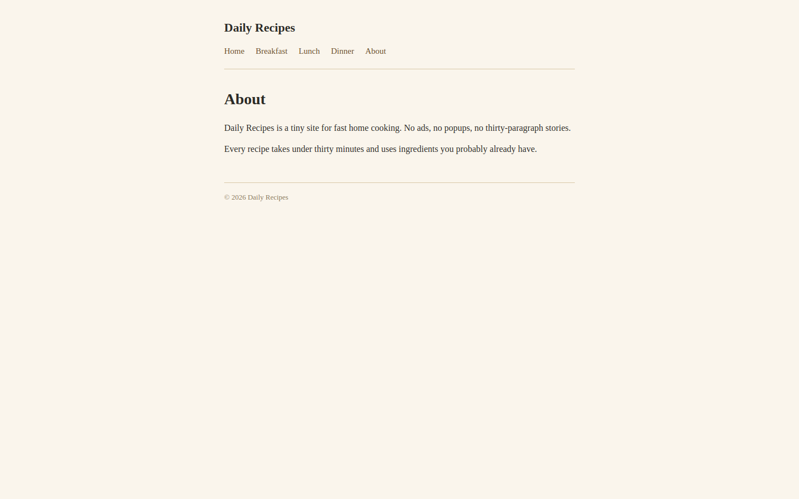 | 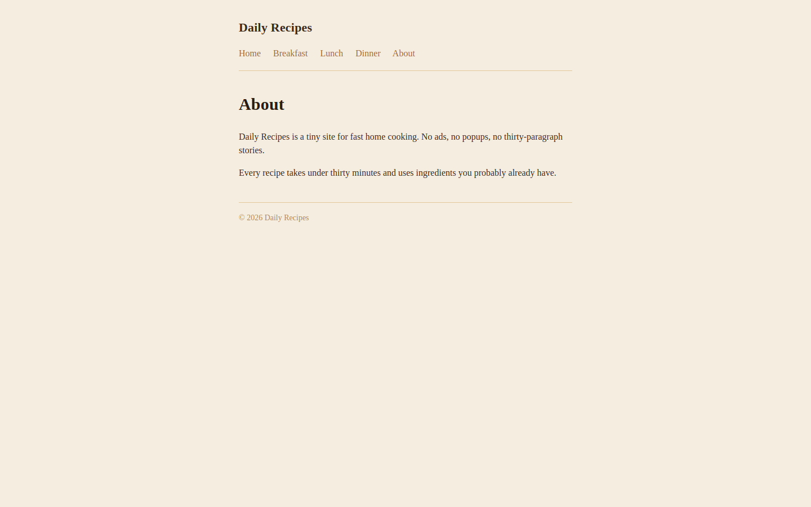 |

Same layout, same color palette, content reproduced verbatim (text=1.000, palette=0.880).

**Mid — 009-real-estate-crm (reward 0.550)** — agent gets the design system mostly right but misses on density and accent colors:

| Reference | Candidate (best trial) |
|---|---|
|  | 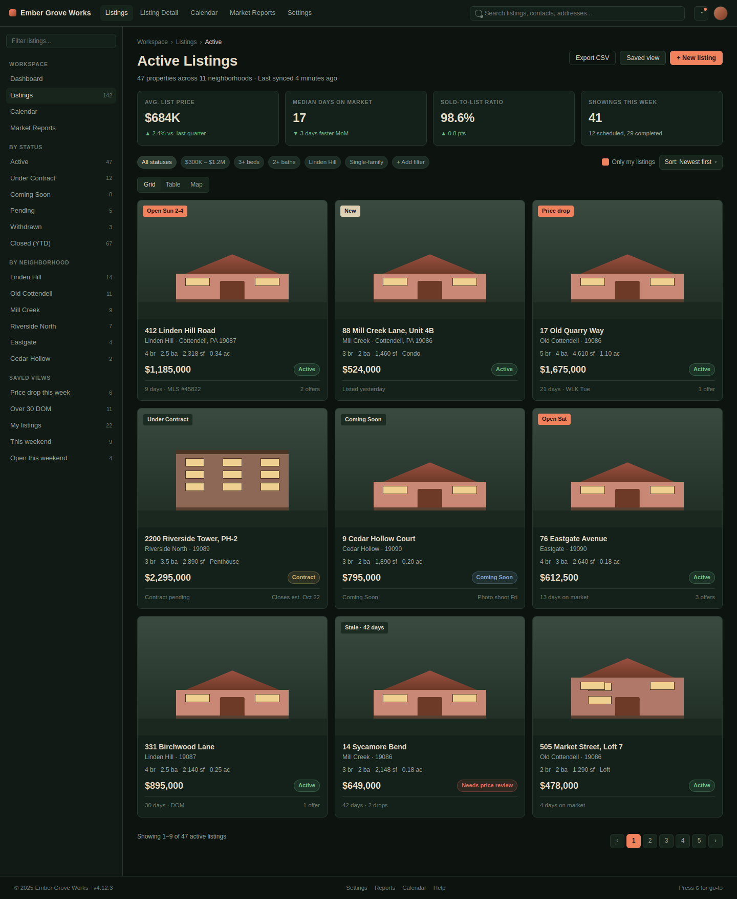 |

Nav, footer, and overall layout match; the listing-card grid has the right column count; typography is in the correct family. But the accent palette drifts away from the reference's terracotta toward generic warm-grey (palette=0.76), and several listing fields are fabricated (text=0.67). The score lands in the 0.5–0.6 band that characterises "structurally faithful, content imperfect" trials — the bulk of the dashboard tier.

**Worst — 010-nonprofit-donations (reward 0.292)** — agent invents a parallel universe of the brand:

| Reference | Candidate (best trial) |
|---|---|
| 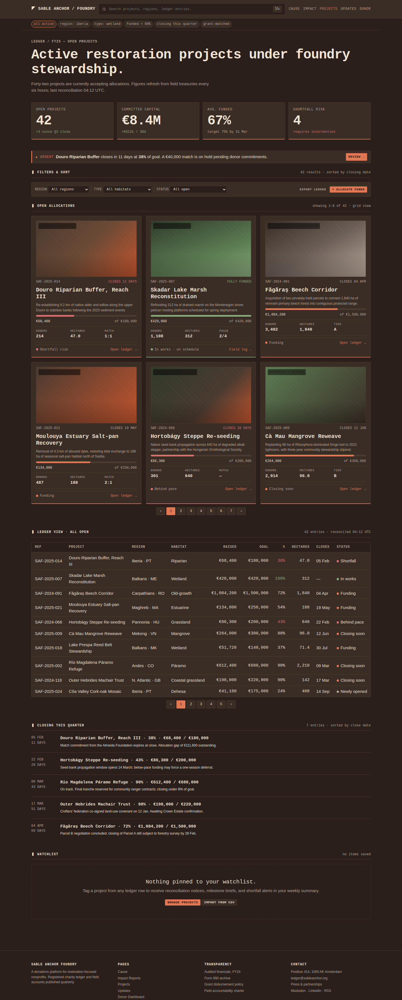 | 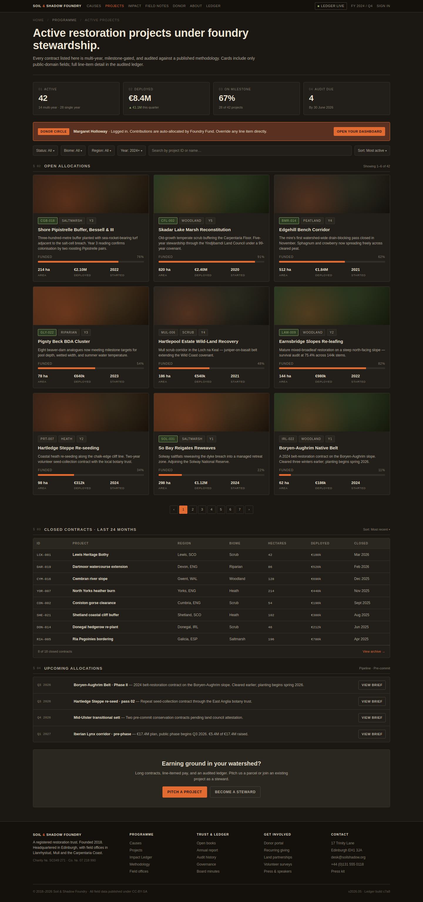 |

The candidate keeps the layout structure but **invents every text field** — brand name, project names, funding totals, currency. VLM rated this 0.3 ("fundamentally different website"); text=0.148. The score collapse to 0.262 is the right answer.

This validates that **(a)** the structured + VLM combination catches both visual-shape correctness and content-fabrication, and **(b)** the overall ranking matches what a human reviewer would say. Hello sites > simple gov sites > complex dashboards > content-fabricated sites.

---

## Observation 2 — Mobile triggers the overflow penalty

Structured score per viewport across all 13 tasks (averaged over best trial of each task, VLM-free, with the overflow multiplier applied):

| Viewport | mean | min | max |
|---|---:|---:|---:|
| desktop | **0.664** | 0.527 | 0.918 |
| tablet | 0.658 | 0.448 | 0.935 |
| mobile | **0.607** | 0.267 | 0.912 |

Mobile consistently lands ~6 points below desktop. The drop is driven by **overflow** — desktop and tablet renders almost never overflow their viewport (overflow ≈ 1.0), while mobile overflow averages 0.87 with high variance, dropping to 0.000 on the worst pages. The multiplier then halves the page composite. Three failure modes drive mobile overflow:

1. **Agent CSS is desktop-first.** Most candidate layouts render at ~600–1000px wide on a 375px viewport.
2. **Multi-column dashboards don't collapse.** Reference designs reflow a 4-column grid to stacked cards at mobile. The agent reuses the same 4-column grid that overflows horizontally.
3. **Missing widgets at mobile.** Sometimes the agent simply drops a widget the reference shows (e.g. calendar grid → bullet list on hr-payroll/time-off).

**Worst case — hr-payroll/time-off mobile:** overflow=**0.000**, structured=0.576, composite=**0.288** (structured × (0.5 + 0.5×0.0)). Candidate renders at 588px on a 375px viewport (57% wider than viewport) and is 34% shorter than the reference (missing content).

| Reference | Candidate |
|---|---|
| 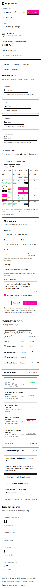 | 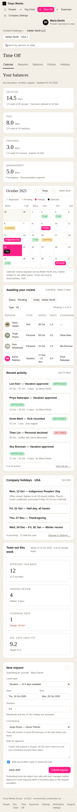 |

This is the design intent of the overflow multiplier — non-responsive output is genuinely caught, not just dinged.

**More mobile-overflow examples:**

*nonprofit-donations / cause-overview* — overflow=**0.000**, composite=**0.267**. Multi-column bento grid renders as a fixed-width layout with no media query.

| Reference (375px) | Candidate (overflows) |
|---|---|
| 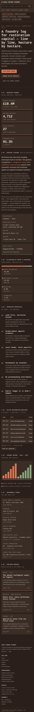 | 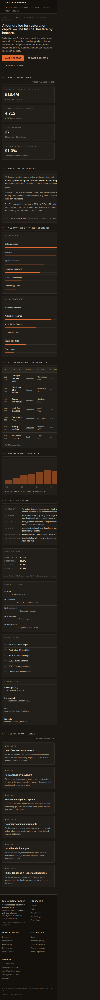 |

*hr-payroll / expenses* — overflow=**0.184**, composite=**0.296**. Wide expenses table keeps all columns at mobile instead of collapsing.

| Reference (375px) | Candidate (overflows) |
|---|---|
| 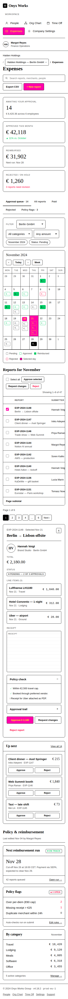 | 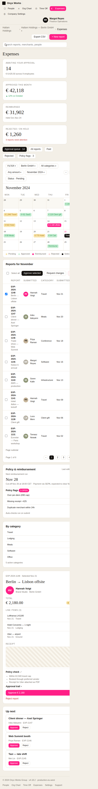 |

The pattern is consistent: the agent writes one set of CSS rules and applies them at every viewport. Reference designs use media queries to collapse multi-column layouts to single-column on mobile; the agent generally does not. Whenever this happens the overflow score collapses (often to exactly 0) and the multiplier halves the page composite, dragging the harmonic mean across viewports down sharply.

---

## Observation 3 — VLM judges desktop more harshly than mobile

Mean VLM score per viewport across all 13 tasks (best trial each):

| Viewport | mean | min | max |
|---|---:|---:|---:|
| desktop | **0.574** | 0.200 | 0.930 |
| tablet | 0.653 | 0.200 | 0.950 |
| mobile | 0.643 | 0.300 | 0.950 |

VLM is consistently ~0.07 lower on desktop than on tablet/mobile, even though the structured score is essentially flat across viewports (0.65 ± 0.01). Three plausible mechanisms (we haven't isolated which dominates):

1. **More visible defects per frame.** Desktop renders pack denser content — full tables, side-by-side charts, multi-column dashboards — all visible at once. The VLM has more material to find disagreements over. Mobile stacks content vertically; each "screenful" of attention covers fewer elements, so fewer comparison opportunities per look.
2. **Content fabrication is harder to hide on a wide canvas.** Wrong numbers in a 12-column table, fabricated chart shapes, or a missing widget are immediately visible on desktop. On mobile the same content is one-column-tall, and the VLM may anchor on layout shape (which the agent gets right) over content (which the agent often fabricates).
3. **Aspect-ratio compression.** We downscale images >7800px on any axis before submitting to the VLM (Anthropic API limit). Desktop pages frequently exceed this on the height axis (1440 × 4000+ is common), so they get downscaled more aggressively than mobile pages. Fine pixel-level detail survives less well, but the *overall* shape comparison the VLM does shouldn't care much about this — listed as a hypothesis but probably the weakest of the three.

Practical implication: VLM's harshness on desktop is *useful* — it catches the content-fabrication errors that the structured score under-counts (text is only weight 0.20, and Jaccard over tokens misses sub-token digit errors). The composite-flat-across-viewports observation in §2 is partly because this VLM harshness on desktop offsets the overflow penalty on mobile. Both ceilings are doing their job, on different axes.

---

## Observation 4 — Some colour palettes are harder to replicate than others

Palette feature score (best trial per task) spans **0.422 → 0.872** — wider than any other structured metric. The pattern is consistent across runs:

| Palette score | Task | Theme |
|---|---|---|
| **0.491** | 005-ecommerce-admin | Dark indigo with neon accents |
| 0.555 | 008-hr-payroll | Dark teal/forest with off-white text |
| 0.643 | 004-devops-platform | Dark with cyan/magenta status pills |
| 0.674 | 007-healthcare-emr | Muted clinical blue with off-white |
| 0.719 | 006-fintech-banking | Light with brand green/gold accents |
| 0.755 | 009-real-estate-crm | Warm light with terracotta accents |
| **0.872** | 001-gov-services | Standard light w/ navy + grey |
| **0.880** | 012-hello-recipes | Warm cream w/ olive accents |

**Findings:**
- **Light themes with conventional brand colors score high.** Government, recipe, portfolio sites all hit palette > 0.85. The agent has strong priors here.
- **Dark themes drift toward a generic "default dark"** (#1a1a2e-ish indigo). Tasks with cyan, teal, or specifically-tinted darks score 0.49 – 0.64. The agent does not faithfully reproduce the *tint* of darkness.
- **Branded accent colors are unreliable.** Even when the overall theme matches, accent pills (status badges, KPI deltas, button highlights) often shift hue — the agent picks "similar enough" rather than exact.

**Why the metric had to split background vs foreground.** An early version of `palette` pooled every visible color into a single distribution and compared centroids. A white-text-on-dark-blue page and a white-text-on-black page averaged to roughly the same centroid and scored as a match — the metric was blind to the actual brand identity (the background). The current metric separately aggregates foreground (text) colors and background colors via area-weighted OKLab L2, then averages the two channel scores. Without this split, the dark-theme drift above wouldn't show up at all: agents that get the text contrast right would mask the background mismatch.

Implication: a small set of palette priors explains a large slice of cross-task variance, and *which* color channel is wrong matters as much as how much it's wrong.

---

## Observation 5 — Numeric content is rarely copied correctly

Text-similarity score (Jaccard over visible tokens) reveals systematic number fabrication. The lowest text scores in the fleet:

| Task / Page | Text score | What's wrong |
|---|---|---|
| 010-nonprofit-donations / projects | **0.148** | Brand name, project names, all funding totals fabricated |
| 010-nonprofit-donations / donor-dashboard | 0.178 | KPI cards with invented dollar amounts |
| 010-nonprofit-donations / impact | 0.217 | Statistics ("2,847 lives impacted") replaced with plausible inventions |
| 006-fintech-banking / transactions | 0.520 | Layout copied perfectly; every transaction amount + merchant changed |

**Example — fintech-banking/transactions:**

| Reference | Candidate (best trial) |
|---|---|
| 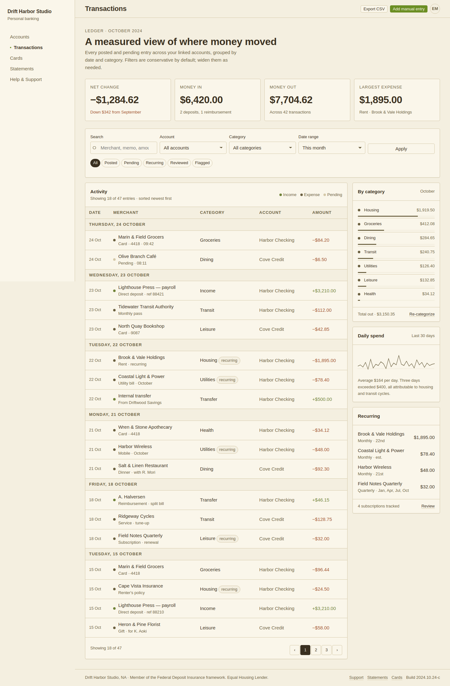 | 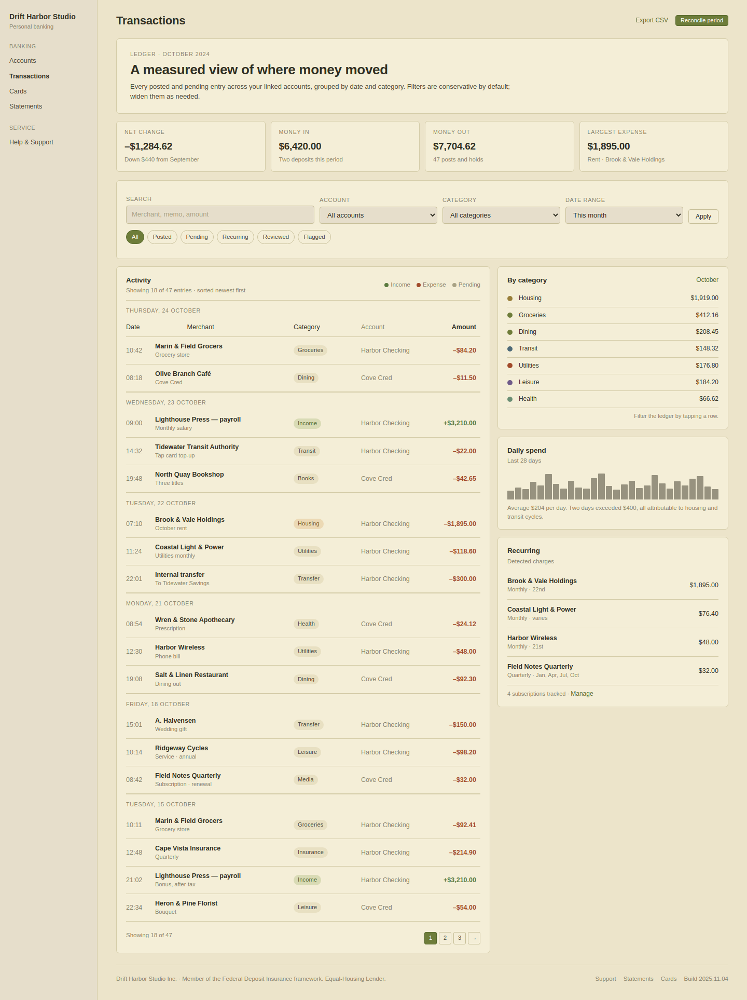 |

The candidate reproduces the table shape, column headers, row count, and visual styling. But a substantial share of transaction amounts differ (some by 5–20%), several merchant names are wrong, and dates shift. SSIM (0.62) and block_match (0.45) don't catch this — the *layout* is correct. Only text similarity (0.52) and the VLM judge (0.45) drive the score down.

This is the failure mode the reward function was specifically tuned to catch — content fabrication that visually looks right. Text weight is the highest (0.20) for this reason; VLM ceiling provides a second pass.

---

## Other observations

### `end_turn` regression (Claude Code 2.1.148)

7 of 130 trials (~5%) showed a planning-stall pattern: the agent read references, issued multiple `TaskCreate` planning steps, then ended its turn with **zero file writes**. All have wall times of 60–90 seconds vs ~10 min for successful trials. Distribution:

| Task | Stall rate |
|---|---|
| 007-healthcare-emr | 4/10 |
| 003-travel-booking | 2/10 |
| 011-hello-portfolio | 1/10 (infra fail, not regression) |

The pattern correlates with task complexity (most reference PNGs to read). Confirmed in `trajectory.json` step 1 that the `IMPORTANT: Write all required files before ending your turn` directive *is* in the agent's prompt — the agent ignored it. This is an upstream Claude Code bug we cannot fix; aggregation handles it by excluding `reward < 0.01` from the mean.

### Per-feature variance is uneven

Per-feature score statistics across the 13 best trials (one per task):

| Feature | Cross-task stdev | Range across tasks | Discriminating power |
|---|---|---|---|
| text | 0.212 | 0.22 → 1.00 | **Very high** |
| vlm_judge | 0.139 | 0.35 → 0.93 | High |
| block_match | 0.124 | 0.37 → 0.77 | Moderate — bounded floor ~0.4 |
| palette | 0.117 | 0.49 → 0.88 | Moderate |
| ssim | 0.112 | 0.56 → 0.93 | Moderate |
| typography | 0.111 | 0.59 → 0.99 | Moderate |
| position | 0.075 | 0.68 → 0.98 | Low |
| overflow | 0.047 | 0.86 → 1.00 | Low (rarely fires below 0.85 on desktop) |

**block_match has a known floor at ~0.37** even on totally-wrong layouts. The Hungarian-IoU formulation with `MAX_BLOCKS=100` cap saturates at "some blocks match by coincidence." Future work could replace it with grid-cell occupancy.

### VLM and structured both contribute

Across 1935 (page, viewport) pairs, VLM is the binding ceiling on **53%** of pairs; the structured score binds on **38%**; the remaining 9% are ties within ±0.01. So neither signal is decorative — VLM catches roughly half the cases (mostly content fabrication and wrong widgets that structured undercounts), structured catches the other half (mostly the better pages where VLM is generous but pixel/layout/text disagreements remain).

### Score variance is bimodal across tasks

Two clusters:
- **Easy / "hello" tier (0.78 – 0.86 mean)**: 011-hello-portfolio, 012-hello-recipes — single-domain marketing sites where agents excel.
- **Dashboard tier (0.26 – 0.62 mean)**: complex multi-page sites with data-heavy widgets, the bulk of the eval.

This is the intended structure of the task set: anchor tasks calibrate the high end; dashboard tasks discriminate among capable agents.

---

## Implications for RL Training

1. **Reward gradient is well-behaved.** No ceiling cluster (best = 0.901, far from 1.0). No floor cluster (worst = 0.262 in a faithful attempt, well above 0.0). Continuous gradient on every task.

2. **Wide cross-task variance (CV ~30%) supports cross-agent benchmarking.** An earlier dashboard-only set had CV ~9% — too narrow to discriminate models. Adding hello-anchors + the large conference-event task to the dashboard-bulk gives both calibration headroom and within-task signal.

3. **Two learnable, high-variance signals: palette and text.** These map onto specific agent behaviors (color matching, content copying) that RL could plausibly improve. They are not noise; they are consistent failure modes.

4. **Mobile responsiveness is a single capability gap.** Mobile underperforms desktop on every dashboard task. Closing this gap would shift the entire suite up by ~0.05 – 0.10 on average.

5. **The 5% `end_turn` stall rate is dead loss in best-of-k.** Improving Claude Code's planning behavior (or moving to a non-regressed version) would lift best-of-10 noticeably without changing per-trial quality.

6. **k=10 is justified.** Within-task stdev of 0.02 – 0.05 plus a 5% stall rate means k < ~7 risks high variance in the best-of-k estimate. k=10 gives reliable best and informative mean.

7. **Numeric content copying is a current ceiling.** The agent cannot reliably copy exact numbers (transaction amounts, KPI values, statistics). Even strong overall trials score in the 0.5 – 0.6 range on dashboards because of this. This is a candidate axis for explicit RL reward shaping.
