# Task Showcase

13 tasks demonstrating the diversity and complexity of the generated environments.

## Distribution Coverage

| # | Task | Domain | Archetype | Palette | Theme | Pages |
|---|------|--------|-----------|---------|-------|-------|
| 1 | 001-gov-services-v7adv | Government Services | dashboard-sidebar | slate-red | mixed | 5 |
| 2 | 002-restaurant-ops-v7adv | Restaurant Operations | data-dense-table | rose-mauve | dark | 5 |
| 3 | 003-travel-booking-v7adv | Travel / Property Mgmt | card-feed-masonry | warm-ivory | light | 5 |
| 4 | 004-devops-platform-v7adv | DevOps / CI-CD | kanban-board | stone-neutral | light | 5 |
| 5 | 005-ecommerce-admin-v7adv | E-Commerce Admin | swiss-grid | coral-cream | mixed | 5 |
| 6 | 006-fintech-banking-v7adv | Consumer Banking | three-pane-docs | cream-gold | light | 5 |
| 7 | 007-healthcare-emr-v7adv | Healthcare / EMR | calendar-grid | clinical-blue | light | 5 |
| 8 | 008-hr-payroll-v7adv | HR / Payroll | wizard-stepper | neon-yellow-pink | light | 5 |
| 9 | 009-real-estate-crm-v7adv | Real Estate CRM | magazine-editorial | terracotta-sage | dark | 5 |
| 10 | 010-nonprofit-donations-v7adv | Nonprofit / Donations | bento-grid | warm-earth | dark | 5 |
| 11 | 011-hello-portfolio-v9 | Portfolio | minimal-single-column | monochrome-gray | light | 5 |
| 12 | 012-hello-recipes-v9 | Recipes | card-grid | parchment-brown | light | 5 |
| 13 | 001-conference-event-v9 | Conference / Events | feed-and-suggestions | mint-peach | mixed | 8 |

## What Makes These Tasks Challenging

### Variety of Layout Patterns
The 13 tasks span fundamentally different layout grammars: sidebar dashboards, dense data tables, kanban boards, calendar grids, wizard steppers, bento grids, and editorial layouts. An agent that memorizes one pattern won't generalize.

### Responsive Design Requirement
Every task is graded at three viewports (1440px, 768px, 375px). A dashboard-sidebar layout must collapse its sidebar on mobile. A kanban board must stack columns. A calendar grid must remain usable on a narrow screen. The harmonic mean across viewports means responsive failures are heavily penalized.

### Theme Diversity
Tasks include light themes, dark themes, and mixed themes (some pages dark, some light within the same site). Mixed-theme sites are particularly challenging because the agent must detect which pages use which theme from the screenshots alone.

### Content Density
Some tasks are content-heavy (data tables with 20+ rows, calendar grids with events, multi-card dashboards) while others are content-light (marketing pages, settings forms). The text similarity metric ensures content fidelity, not just visual fidelity.

### Shared Component Library
All pages within a site share a single styles.css. The agent must discover this shared design system from the screenshots — consistent colors, typography, navigation, and component patterns across pages.

### Difficulty Range
The task set intentionally spans a difficulty range. Tasks 011 and 012 are simpler "hello world" sites (portfolio, recipes) with minimal layouts — these should score high and serve as calibration anchors. The complex tasks (dashboard-sidebar, data-dense-table, calendar-grid) score significantly lower. The 8-page conference-event task tests scalability. This range ensures the eval set discriminates across agent capability levels rather than clustering all scores in a narrow band.

## Visual Diversity

The screenshots below show one representative page per task at desktop viewport. Note the range of layout patterns, color schemes, content density, and themes — no two sites share the same visual identity.

### Dark Themes
| Restaurant Ops — data-dense-table | Real Estate CRM — magazine-editorial | Nonprofit Donations — bento-grid |
|---|---|---|
| 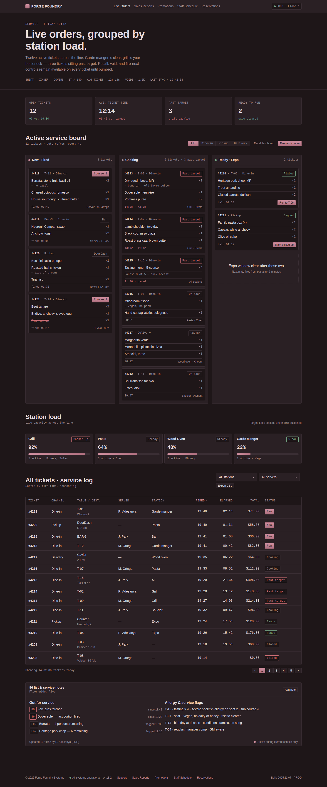 | 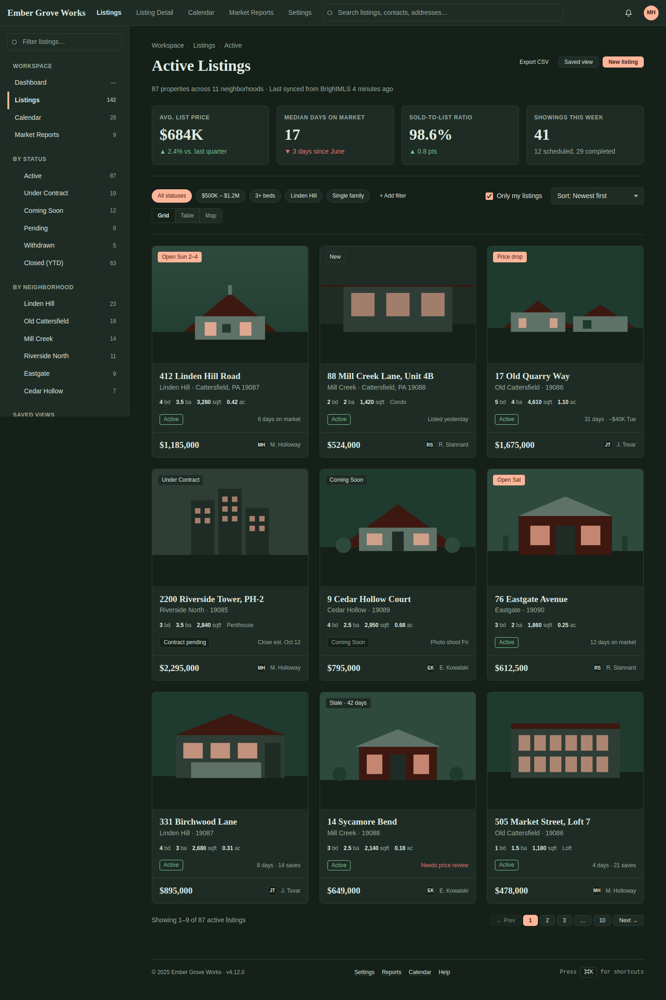 | 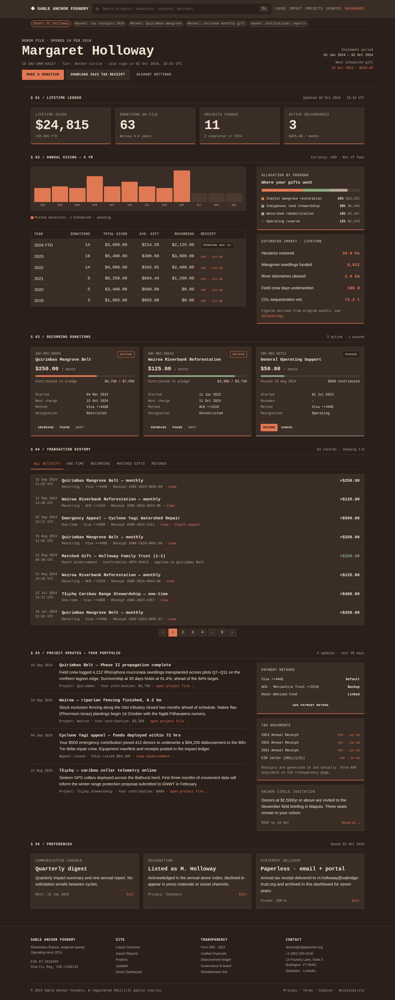 |

### Light Themes
| Travel Booking — card-feed-masonry | DevOps Platform — kanban-board | HR Payroll — wizard-stepper |
|---|---|---|
| 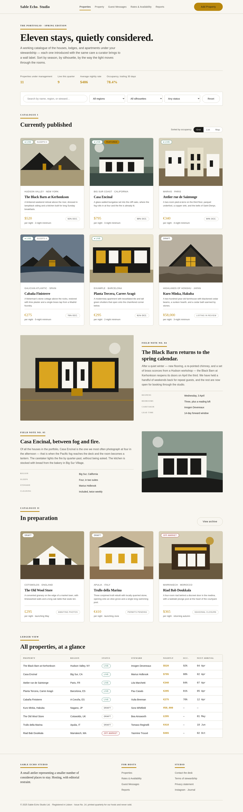 | 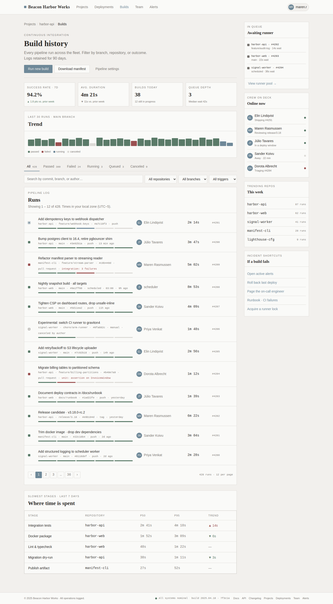 | 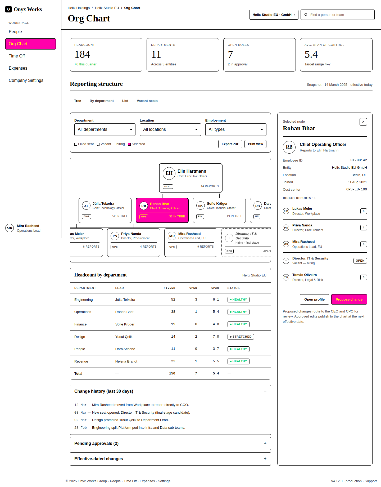 |

### Simple "Hello World" Tasks (calibration anchors)
| Portfolio — minimal-single-column | Recipes — card-grid |
|---|---|
| 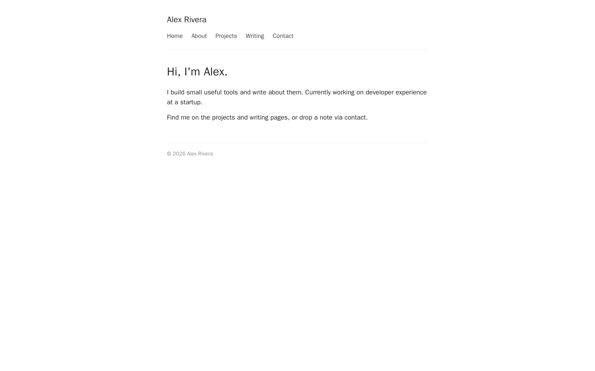 | 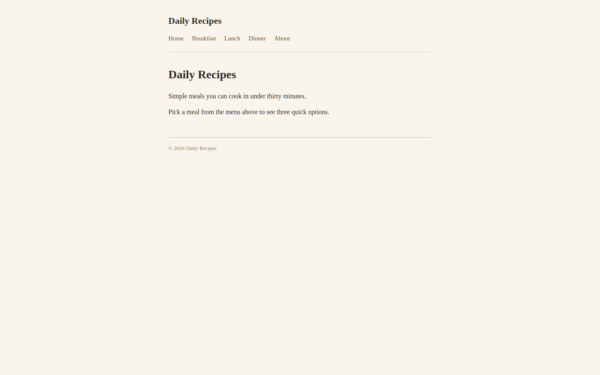 |

### 8-Page Task
| Conference Event — feed-and-suggestions (8 pages) |
|---|
| 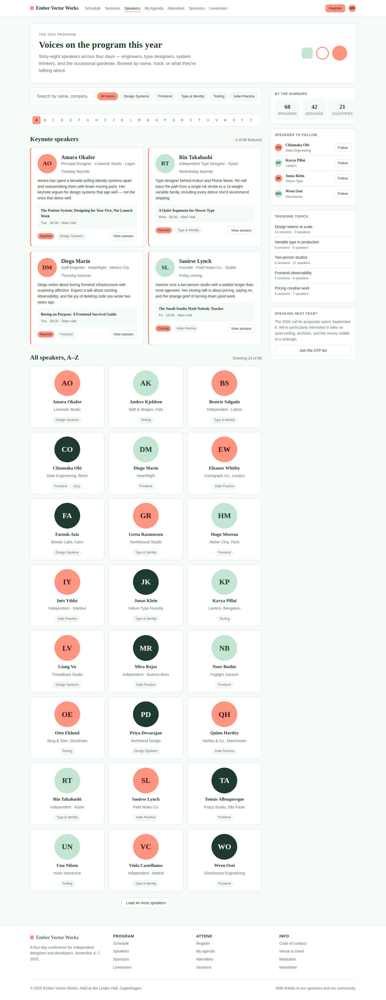 |

### Same Concept, Different Sites

The strongest proof of diversity: pages that serve the same function look nothing alike across sites. The pipeline's independent axis shuffling (domain × archetype × palette × theme) ensures that even when two sites share a page concept, the visual treatment is completely different.

**"Dashboard / Overview"** — three sites, three entirely different layouts for the same concept:

| Fintech Banking | Healthcare EMR | Nonprofit Donations |
|---|---|---|
| 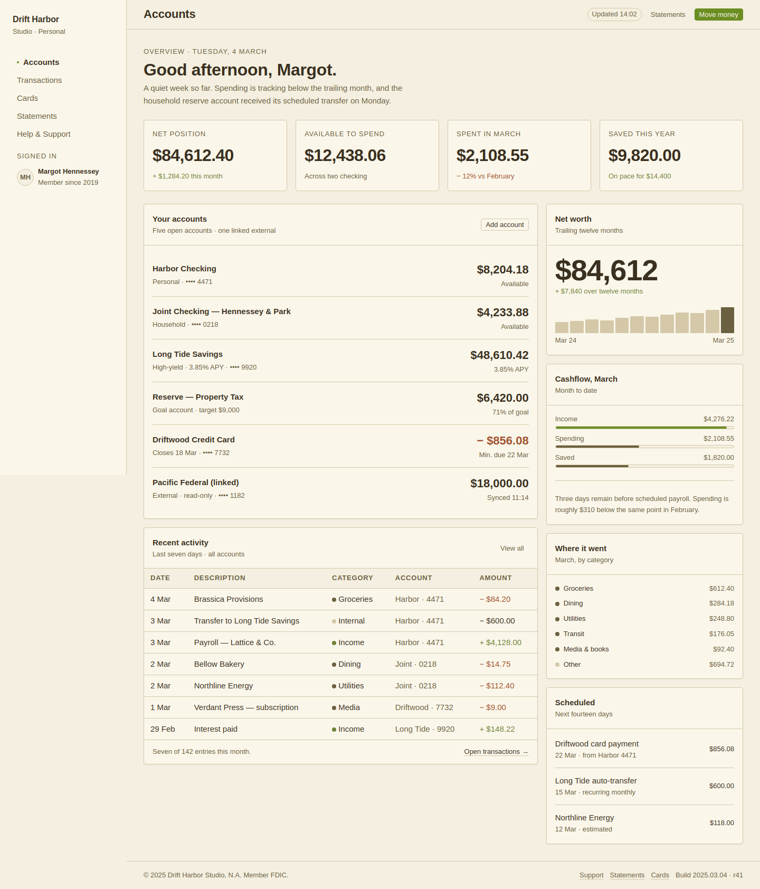 | 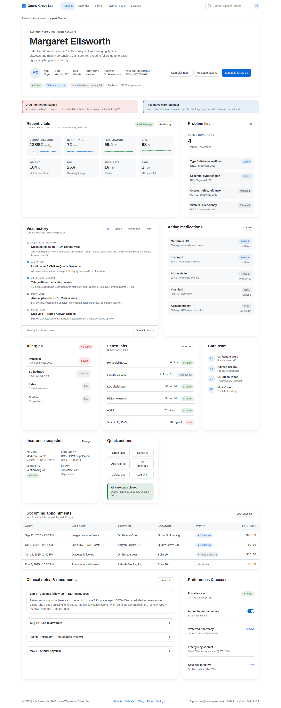 |  |

**"Settings"** — same page type, one light and one dark, completely different component patterns:

| HR Payroll (light, calendar + policy tables) | Real Estate CRM (dark, tabbed panels) |
|---|---|
| 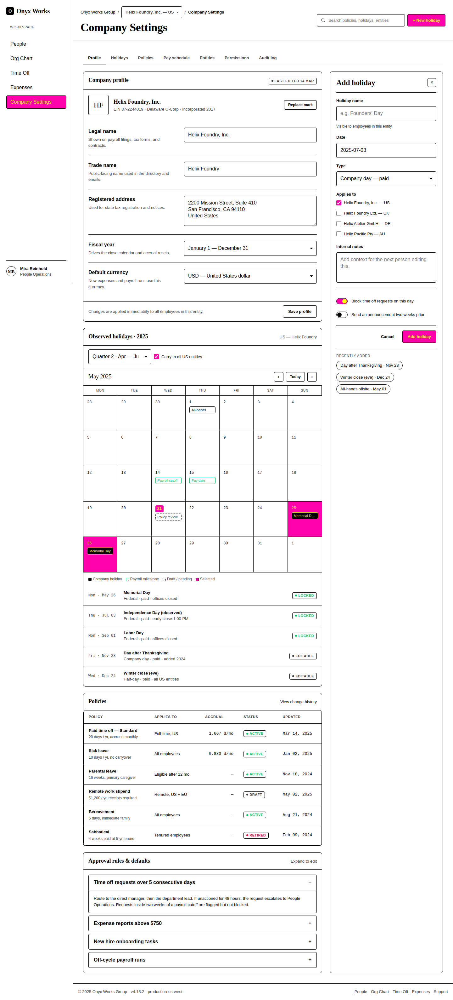 | 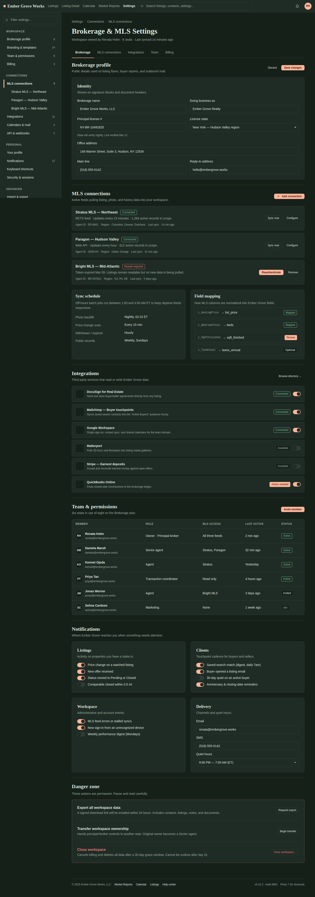 |

### Multi-Viewport Example

The same page rendered at all three viewports, showing how the layout must adapt:

| Desktop (1440×900) | Tablet (768×1024) | Mobile (375×812) |
|---|---|---|
| 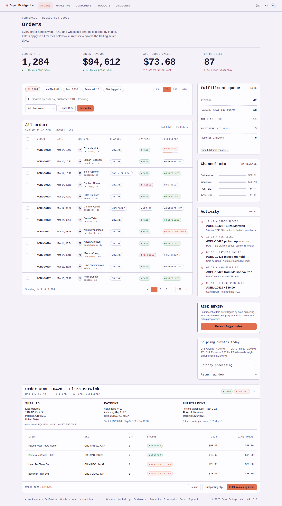 | 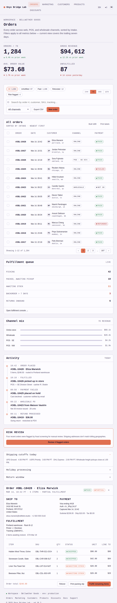 | 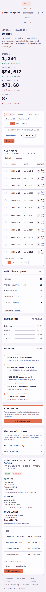 |

## File Structure

Each task has `{page}.{viewport}.png` files for every page at every viewport:

```text
tasks/001-gov-services-v7adv/environment/reference/
├── account.desktop.png
├── account.tablet.png
├── account.mobile.png
├── application.desktop.png
├── ...
└── service-catalog.mobile.png   (15 PNGs total)
```

The 8-page conference-event task has 24 reference PNGs.
